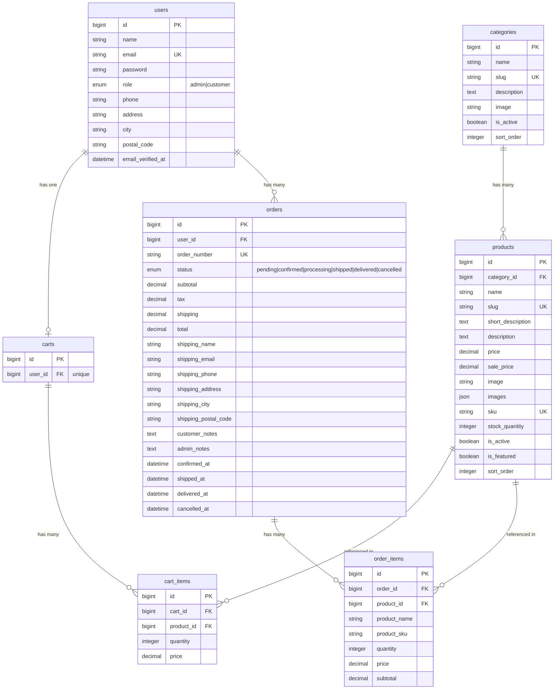
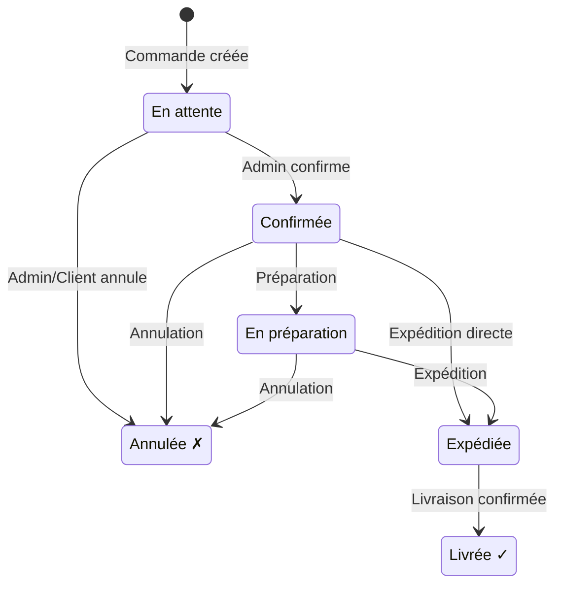
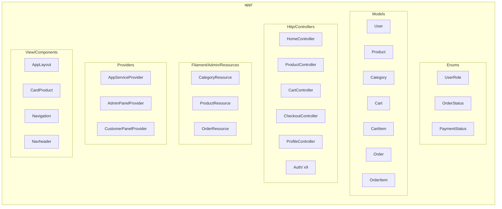

# Diagrammes Mermaid pour Lucidchart

## 1. Diagramme ER (Entity Relationship)



## 2. Architecture en couches (C4 - Container)

```mermaid
graph TB
    subgraph "Utilisateurs"
        V[Visiteur/Client]
        A[Administrateur]
    end

    subgraph "Frontend Layer"
        BL[Blade Views<br/>TailwindCSS + Alpine.js]
        VT[Vite Build Tool]
    end

    subgraph "Application Layer"
        subgraph "Filament Panels"
            AP[Admin Panel /admin<br/>Category + Product + Order Resources]
            CP[Customer Panel /customer<br/>Espace Client]
        end

        subgraph "Controllers"
            HC[HomeController]
            PC[ProductController]
            CC[CartController]
            CHC[CheckoutController]
            PRC[ProfileController]
            AC[Auth Controllers x9]
        end
    end

    subgraph "Domain Layer"
        subgraph "Enums"
            UR[UserRole<br/>admin | customer]
            OS[OrderStatus<br/>pending → confirmed → processing → shipped → delivered]
            PS[PaymentStatus<br/>unpaid | paid | refunded | failed]
        end

        subgraph "Models"
            U[User]
            P[Product]
            CAT[Category]
            CT[Cart]
            CI[CartItem]
            O[Order]
            OI[OrderItem]
        end
    end

    subgraph "Infrastructure"
        DB[(Database<br/>SQLite/MySQL)]
        ST[Stripe API<br/>Paiement]
        FS[File Storage<br/>Images]
    end

    V --> BL
    A --> AP
    BL --> HC & PC & CC & CHC & PRC & AC
    AP --> U & P & CAT & O
    CP --> U & O
    HC & PC --> P & CAT
    CC --> CT & CI
    CHC --> O & OI & ST
    PRC & AC --> U
    U & P & CAT & CT & CI & O & OI --> DB
    P & CAT --> FS
```

## 3. Flux de commande (Order Workflow)



## 4. Flux utilisateur (Parcours d'achat)

```mermaid
flowchart TD
    A[Visiteur arrive] --> B[Page Accueil /]
    B --> C[Catalogue /products]
    B --> D[Catégorie /categories/slug]
    C --> E[Fiche produit /products/slug]
    D --> E
    E --> F{Authentifié ?}
    F -->|Non| G[Login/Register]
    G --> F
    F -->|Oui| H[POST /cart/add - Ajout panier]
    H --> I[Panier /cart]
    I --> J[Modifier quantités]
    I --> K[Supprimer items]
    I --> L[GET /checkout]
    L --> M[Formulaire livraison]
    M --> N[POST /checkout - Paiement Stripe]
    N --> O[Stripe Checkout Session]
    O --> P{Paiement réussi ?}
    P -->|Oui| Q[/checkout/success<br/>Commande confirmée]
    P -->|Non| R[/checkout/cancel<br/>Retour panier]
    R --> I
    Q --> S[Fin - Commande en base]
```

## 5. Architecture des fichiers (Component Diagram)


